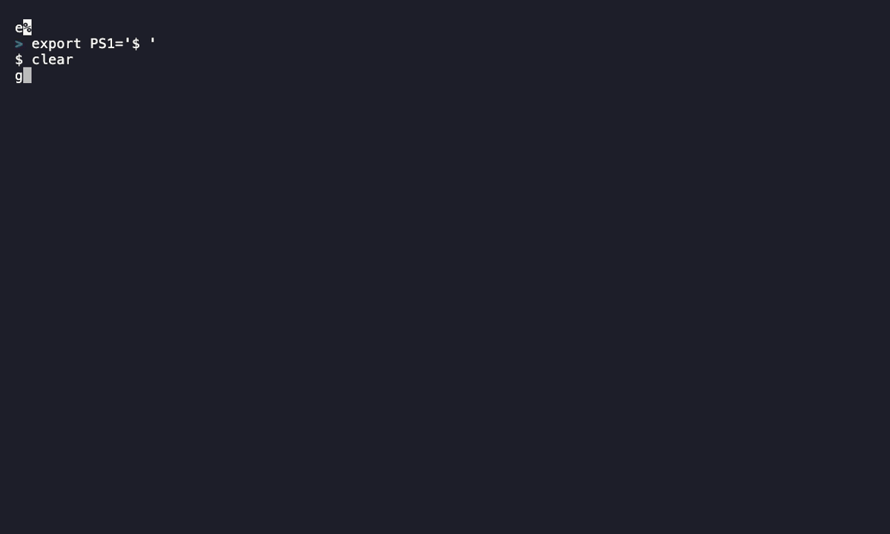

# gh-prod-map

A precompiled [GitHub CLI](https://cli.github.com) extension, written in Go, that maps how teams
manage production code across many repositories. It inspects default branches, pull request target
branches, tags, and releases, then classifies each repository into a production-maintenance pattern
and writes a detailed report.

| Concern | Library |
| ------- | ------- |
| Subcommands & flags | [spf13/cobra](https://github.com/spf13/cobra) |
| Terminal UI (spinners, progress bars, tables) | [pterm/pterm](https://github.com/pterm/pterm) |
| GitHub API calls (GraphQL preferred) | [cli/go-gh](https://github.com/cli/go-gh) |
| Optional AI summaries | [github/copilot-sdk](https://github.com/github/copilot-sdk) |
| Demo recordings | [charmbracelet/vhs](https://github.com/charmbracelet/vhs) |



## Prerequisites

- [GitHub CLI](https://cli.github.com) (`gh`), authenticated with `gh auth login`
- [Go](https://go.dev/dl/) — only needed to build from source (see the version pinned in `go.mod`)

## Installation

```sh
gh extension install CallMeGreg/gh-prod-map
```

Or build and install from source:

```sh
git clone https://github.com/CallMeGreg/gh-prod-map.git
cd gh-prod-map
go build -o gh-prod-map .
gh extension install .
```

Then confirm it resolves:

```sh
gh prod-map --help
```

## Usage

`gh prod-map` scans a single repository, an organization, or an entire enterprise and
classifies how each repository is maintained for production. Scope every run to exactly one of
`--repo`, `--org`, or `--enterprise` (they are mutually exclusive).

```sh
# A single repository
gh prod-map --repo github/docs

# One organization, capped at 200 repos, custom CSV path
gh prod-map --org github --repo-limit 200 --csv-out prod-map.csv

# An entire enterprise (all orgs, all repos) with optional AI theme analysis
gh prod-map --enterprise github --org-limit 0 --repo-limit 0 --ai
```

> The extension is installed as `gh-prod-map` and invoked as `gh prod-map`. There are no
> subcommands — the scope flags select what to scan.

### Scope flags

| Flag | Alias | Default | Description |
| ---- | ----- | ------- | ----------- |
| `--repo` | `-r` | | GitHub repository as `owner/name` (mutually exclusive with `--org` / `--enterprise`) |
| `--org` | `-o` | | GitHub organization login (mutually exclusive with `--repo` / `--enterprise`) |
| `--enterprise` | `-e` | | GitHub Enterprise slug (mutually exclusive with `--repo` / `--org`) |
| `--hostname` | `-u` | `github.com` | GitHub host (e.g. `github.example.com` for GitHub Enterprise Server) |

### What it collects

For every repository in scope, `prod-map` collects:

- the default branch
- the most common pull request target (base) branch
- tag count and recent tags
- release count and the latest release

It classifies each repository into a production pattern, prints summary tables with progress
feedback, and writes a detailed CSV report.

Example output:

```
 SUCCESS  Scanned repositories: 200

Production Pattern     | Repositories
release-driven         | 84
trunk-driven           | 61
tag-driven             | 29
stabilization-branch   | 18
insufficient-signals   | 8

Default Branch | Repositories
main           | 173
master         | 21
develop        | 6

 SUCCESS  Wrote CSV report: prod-map.csv
```

Each repository is classified as:

| Pattern | Meaning |
| ------- | ------- |
| `release-driven` | The repository publishes GitHub releases |
| `tag-driven` | The repository has tags but no releases |
| `trunk-driven` | Most pull requests target the default branch |
| `stabilization-branch` | Most pull requests target a non-default branch |
| `insufficient-signals` | No branches, tags, or releases to classify |

The CSV report (`--csv-out`, default `prod-map-report.csv`) has one row per repository with the full
signal breakdown: owner, repository, default branch, top PR target branch and count, sampled pull
requests, tag and release totals, recent tags, latest release details, and the production pattern.

Pass `--ai` to run optional [Copilot SDK](https://github.com/github/copilot-sdk) post-processing that
buckets similar patterns into themes. If the SDK is unavailable, `prod-map` falls back to a local
heuristic summary.

#### Report flags

| Flag | Default | Description |
| ---- | ------- | ----------- |
| `--repo-limit` | `0` | Maximum repositories to scan with `--org` or `--enterprise` (`0` = all discovered) |
| `--org-limit` | `0` | Maximum organizations to scan with `--enterprise` (`0` = all) |
| `--pr-limit` | `200` | Maximum pull requests to sample per repository |
| `--tag-limit` | `20` | Maximum recent tags to include in report details |
| `--release-limit` | `20` | Maximum recent releases to include in report details |
| `--csv-out` | `prod-map-report.csv` | CSV report path (empty string disables the report) |
| `--ai` | `false` | Run optional Copilot SDK analysis of pattern themes |
| `--ai-model` | `gpt-5-mini` | Model used for the optional Copilot SDK analysis |

## API usage philosophy

- Every GitHub API call goes through [cli/go-gh](https://github.com/cli/go-gh).
- **Prefer the GraphQL API over REST** whenever both expose the same data.
- Listing the organizations in an enterprise **always uses GraphQL** (REST cannot do it).
- Commands pass the `--hostname` value into the client so they work against GitHub.com and GitHub
  Enterprise Server.
- GraphQL calls retry automatically on primary rate-limit errors, waiting until the limit resets.

Reusable go-gh clients and pterm helpers live in [`cmd/common.go`](cmd/common.go).

## Project structure

```
.
├── main.go              # Entry point; calls cmd.Root()
├── cmd/
│   ├── root.go          # Core command, scope flags, error rendering
│   ├── common.go        # go-gh clients, pterm helpers, shared GraphQL queries
│   └── prod_map.go      # Pattern detection, discovery, CSV + AI output
└── demo/
    └── demo.tape        # VHS script for the demo GIF
```

## Recording the demo

The demo GIF is generated from [`demo/demo.tape`](demo/demo.tape) with
[VHS](https://github.com/charmbracelet/vhs):

```sh
go build -o gh-prod-map .
gh extension install .
vhs demo/demo.tape
```

## Releasing

Releases are automated by [`.github/workflows/release.yml`](.github/workflows/release.yml):

1. Open a PR and check a box in the **Release Type** section (Major / Minor / Patch).
2. When the PR merges to `main`, the workflow reads that box, computes the next semantic version,
   tags it, and runs [`cli/gh-extension-precompile`](https://github.com/cli/gh-extension-precompile)
   to build cross-platform binaries with build provenance attestations.
3. Dependabot PRs default to a patch release.

## License

[MIT](LICENSE)
